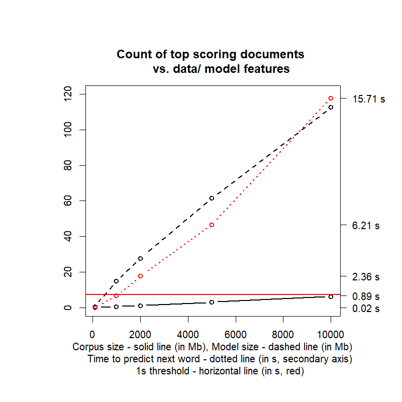
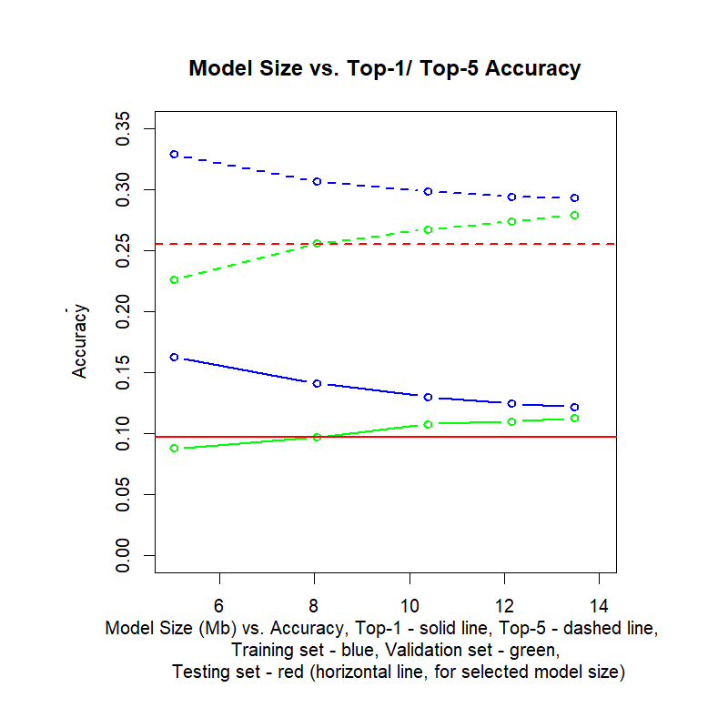
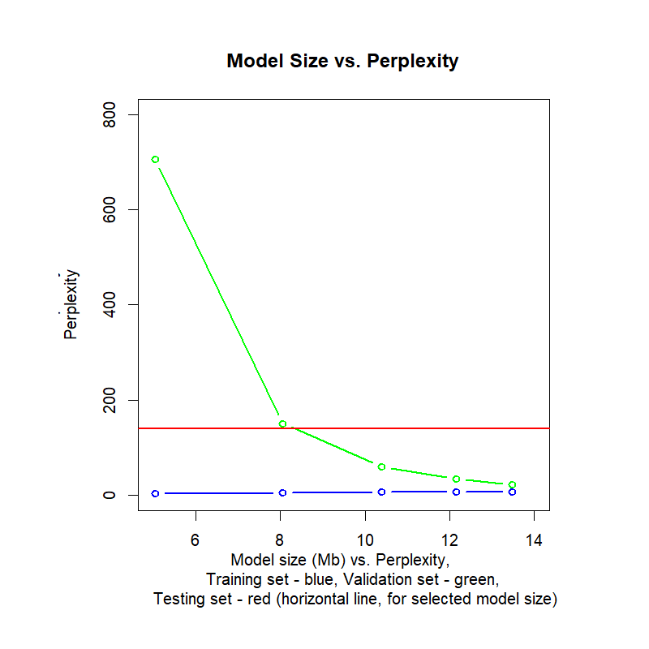
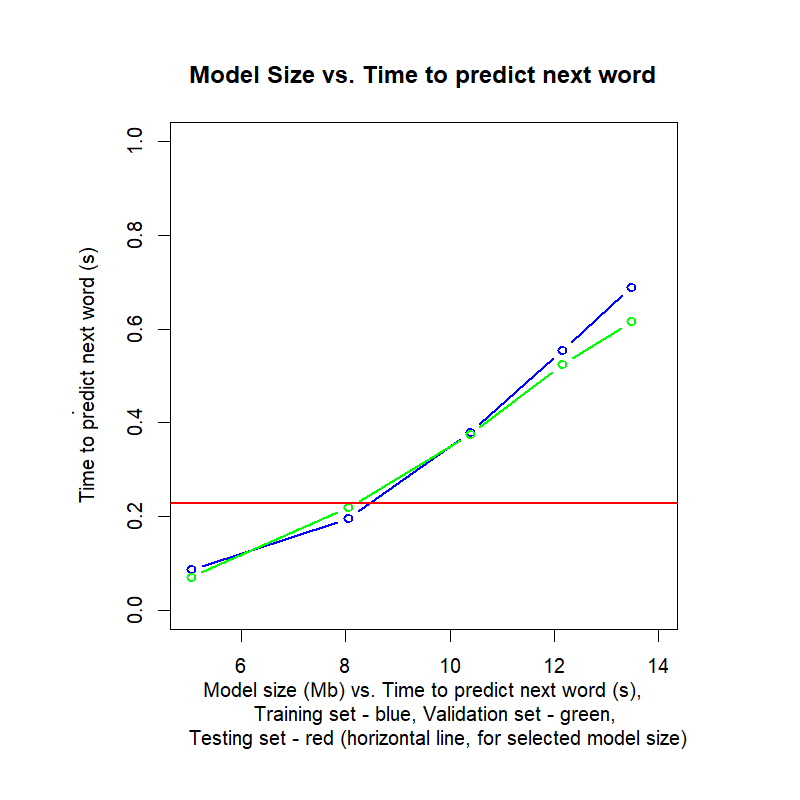
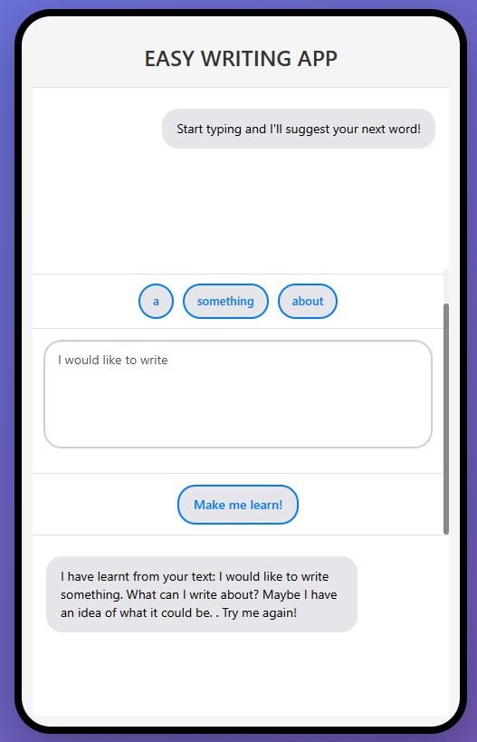

```{r setup, include=FALSE}
knitr::opts_chunk$set(echo = FALSE)

## NextWordApp - Coursera/ JHU Data Science Capstone Project
## https://thinkerspark.shinyapps.io/NextWordApp/
## NextWordApp
## Text prediction application built for Coursera/ John Hopkins University Data Science Capstone Project (part of Data Science ## Specialisation)


## NextWordApp - Coursera/ JHU Data Science Capstone Project
## This presentation describes the text prediction app built for the Coursera/ John Hopkins University Data Science Capstone ## Project (part of Data Science Specialisation). The app is available at <https://thinkerspark.shinyapps.io/NextWordApp/>.

## DataScienceCapstone_ProgressReport

## To be published at https://thinkerspark.github.io/DataScienceCapstoneProject/
```

## The Algorithm: Interpolated KEN Smoothing

The underlying algorithm is the interpolated Kneser-Essen-Ney (KEN) smoothing algorithm, which is widely used as a method  to calculate the probability distribution of n-grams in documents, based on their histories [1]. At a high level, interpolated KEN smoothing is a recursive algorithm where first the probability of the word $w_{n}$ occurring after the previous $k$ words $\{w_{n-1},...,w_{n-k}\}$ is calculated, then after the previous $k-1$ words $\{w_{n-1},...,w_{n-(k-1)}\}$, and so on, until the unigram probability of the word $w_{n}$.

At each step, the algorithm uses a discounting factor to adjust the probabilities of observed n-grams, and redistributes a "backoff" probability mass to unseen n-grams. This helps to handle the issue of zero probabilities for unseen n-grams - if an n-gram is unseen (i.e. the word $w_{n}$ never occurs after the previous $k$ words $\{w_{n-1},...,w_{n-k}\}$), the algorithm assigns a non-zero probability to such an instance, and redistributes the backoff weight to lower-order n-grams (i.e. in the next iteration, the word $w_{n}$ occurring after the previous $k-1$ words $\{w_{n-1},...,w_{n-(k-1)}\}$), and ultimately to the unigram probability of the word $w_{n}$.

For $n=2$ (bigrams), the probability that the word $w_{n}$ occurs after the word $w_{n-1}$ is calculated as:


- The number (count) of $w_{n-1}$ bigrams that the word $w_{n}$ completes, $C(w_{n-1},w_{n})$, discounted by a factor $d$, 
- Divided by the sum of counts of $w_{n-1}$ bigrams completed by any word $v$, $\sum_{v}{C(w_{n-1},v)}$, and 
- Adjusted by the backoff weight $\lambda(w_{n-1})$ multiplied by the unigram probability of the word $w_{n}$, $P_{kn}(w_{n})$.
 
$$P_{KEN}(w_{n}|w_{n-1}) = \frac{max(C(w_{n-1},w_{n})-d,0)}{\sum_{v}{C(w_{n-1},v)}} - \lambda(w_{n-1}) \times P_{KEN}(w_{n})$$ 

The unigram probability of the word $w_{n}$ is calculated based on the number of bigrams that the word $w_{n}$ completes, relative to the total number of bigrams in the corpus:

$$P_{KEN}(w_{n})=\frac{|\{w:C(w,w_{n})>0\}|}{|\{(w,v):C(w,v)>0\}|}$$
In this way, some of the probability mass is re-distributed to unseen bigrams, and the probability of unseen bigrams is calculated based on the unigram probability of the word $w_{n}$. With $\lambda(w_{n-1})$ calculated as below, and $|\{v:C(w_{n-1},v)>0\}|$ being the number of $(w_{n-1},v)$ bigrams (completed by any word $v$), the probabilities normalise to 1:

$$\lambda(w_{n-1}) = \frac{d}{\sum_{v}{C(w_{n-1},v)}} \times |\{v:C(w_{n-1},v)>0\}|$$ 
In general, for n-grams, the probability that word $w_{n}$ occurs after the words $\{w_{n-k},...,w_{n-1}\}$ is calculated as:

$$P_{KEN}(w_{n}|w_{n-1},...,w_{n-k})=\frac{max(C(w_{n-k},...,w_{n-1},w_{n})-d,0)}{\sum_{v}{C(w_{n-k},...,w_{n-1},v)}} - 
\lambda(w_{n-1},...,w_{n-k}) \times P_{KEN}(w_{n}|w_{n-1},...,w_{n-(k-1)})$$ 

where:

$$\lambda(w_{n-1},...,w_{n-k}) = \frac{d}{\sum_{v}{C(w_{n-k},...,w_{n-1},v)}} \times |\{v:C(w_{n-k},...,w_{n-1},v)>0\}|$$ 
and again $|\{v:C(w_{n-k},...,w_{n-1},v)>0\}|$ being the number of $\{w_{n-k},...,w_{n-1}\}$ bigrams (completed by any word $v$).

The KEN algorithm is equally effective for both higher and lower order n-grams [1].

 [1] <https://en.wikipedia.org/wiki/Kneser-Ney_smoothing>
 

 [2] <https://web.stanford.edu/~jurafsky/slp3/C.pdf>

## Data & Document Scoring

The key challenge of this project was to reduce the data size in a way that the ultimate data set provides a sufficiently rich signal for the model to learn from, while being small enough to be manageable in terms of memory and processing time.

The first iteration of this process was based on document scoring - to select the right number of documents to train the model. The initial corpus, comprising documents from all three data sets (blogs, news and twitter), was read-in and adequately pre-processed (all documents in lower case, punctuation/ numbers/ symbols removed, non-English text discarded). Then, the document-term matrix (DTM) was generated using term frequency-inverse document frequency (Tf-Idf) frequencies as the weighting function. Form there, documents were scored based on the sum of their Tf-Idf frequencies, and the top scoring documents were selected for training the model.

<div style="display: flex; gap: 20px;">
  <div style="flex: 0 0 35%; display: flex; align-items: center; justify-content: center;">
  {height=100%, width=80%}
  </div>
  <div style="flex: 0 0 65%; align-items: center; justify-content: center;">
  
  The plot illustrates the various features depending on the corpus size, ranging from 100 through to 1k, 2k, 5k and 10k top scoring documents which would ultimately form the model training set. The features include the corpus size (solid line), the matching KEN model size (increasing rapidly with the large number of n-grams, dashed line), and finally the time to predict the next word (dotted line, secondary axis). 
  
  The critical features were the model size - within the limits of deployment, and the time to predict the next word - in an app context, this needs to be as low as possible. With the envisaged "model learning" feature (see further slides), the prediction time boundary was set at 1s (highlighted with the red horizontal line), which led to the 2k-document corpus being selected.
  
  Further optimisation of the model size based on performance evaluation was performed, as described on the next slides.
    
  </div>
</div>


## Evaluating Model Performance

The models of various sizes are compared based on their top-1/ top-5 accuracy and perplexity.

Top-1/ top-5 accuracy is calculated as the proportion of times the correct next word is the most likely option (top-1), or among the top 5 most likely options (top-5) predicted by the model. The higher the accuracy, the better the model is at predicting the next word in a sequence.

Perplexity, in general, is the geometrical mean of probabilities of specific words, or sequences of words such as n-grams [3]. In the case of the KEN model, where conditional probabilities of specific n-grams $(w_{n-k},...,w_{n-1},w_{n})$,  $P_{ken}(w_{n}|w_{n-1},...,w_{n-k})$, for $n=1,...,N$ n-grams, form a well-defined probability space (i.e. they are non-negative and sum to 1 through re-distribution of probability mass to unseen n-grams), the perplexity is calculated as:

$$Perplexity_{KEN} = (\prod_{n=1,...,N}P_{KEN}(w_{n}|w_{n-1},...,w_{n-k}))^{-\frac{1}{N}}= exp(-\frac{1}{N}\sum_{n=1,...,N}{log(P_{KEN}(w_{n}|w_{n-1},...,w_{n-k}))})$$
The lower the perplexity, the better the model is at predicting the next word in a sequence.

Both the top-1/top-5 accuracy and the perplexity can be calculated for validation and test sets of n-grams, and can be used to compare the performance of models of different sizes, and to ultimately calibrate the model size for the app. 

[3] <https://www.geeksforgeeks.org/nlp/perplexity-for-llm-evaluation/>

## Calibrating Model Size

In general, the larger the model size, the higher the accuracy and the lower the perplexity, but also the longer the time taken to make predictions. Calibrating the right model size needs to achieve a reasonable balance between performance and prediction time for the app.

The figures included below illustrate how the calibration process was performed by evaluating accuracy, perplexity and time to predict the next word over the the training set and the validation set, for models of different sizes. To note - the model size is increased by expanding the training set of top scoring documents, where subsequently added documents have decreasing scores. For this reason, the model performance (measured with top-1 and top-5 accuracy and perplexity) does not improve **over the training set** (blue lines) with the increasing model size, as the added documents are relatively more noisy and the signal they add to the model is weaker than the noise. However, the model performance **over the validation set** (green lines) does visibly improve with the increasing model size, which is the expected behaviour. The time to predict the next word consistently increases with the model size, for both the training set (again, blue line) and the validation set (again, green line), which is also the expected behaviour

{height=30%, width=30%} {height=30%, width=30%} {height=30%, width=30%}

The model size ranges from 5Mb to 14Mb. Ultimately, the model size of approx. 8Mb (second-smallest, approx. 20k n-grams) was selected as providing some accuracy improvement vs. 5Mb (top-1 accuracy of approx. 10% vs. 9%, top-5 of approx 25% vs. 22%), while offering a good prediction time of approx. 0.2s (vs. 0.1s) and still being manageable in terms of deployment, including the model learning feature (see next slide). However, clearly, the model size is still quite large and further optimisation would be needed for a commercial app.

The model performance and the time to predict the next word **over the test set** is highlighted with the red line (across all figures), for the selected model size of 8Mb (a single point). The metrics are almost identical to those calculated over the validation set, which is an indication of the model generalising well to unseen data.

## Building & Using the App

<div style="display: flex; gap: 20px;">
  <div style="flex: 0 0 35%; display: flex; align-items: center; justify-content: center;">
{height=100%, width=100%}

  </div>
  <div style="flex: 0 0 65%;">
  
  The app is built using the Shiny package in R, and is available at <https://thinkerspark.shinyapps.io/NextWordApp/>. 
  
  It   allows users to input text into the designated window, and predicts the next word based on the trained KEN model. The top 3 most likely options are displayed for the user to choose from, or to continue writing on their own. The options are updated in real time as the user continues writing. 
  
  The model size has been calibrated to update the options within 1s, while maintaining reasonable level of accuracy for its predictions.

  The app can also learn from the user's input, through the "Make me learn!" button. When the user clicks on this button, the model will add the input text to its training data, and update the probabilities of the n-grams accordingly (within the same app session). The update typically completes within 5s, depending on the input text length. Testing has shown that after two rounds of learning from the same input text, the text can be largely re-created through the displayed next word options.
  
  The design resembles the SMS writing functionality typical for modern smartphones, making it relatable and user-friendly. Also, it is an easy way to include the necessary user guidance directly within the app's layout.
  
  </div>
</div>


